# Repository for LiveNation SFDC Assets.

## Overview

LiveNation is a ticketing / event agency and this project is to replace the existing ROME application into Salesforce.

Rome was a system for entering / managing data related to Artists / Agencies / Deals / Events and Finances. (For more information, please read section 6.1 of the [Solution Design](https://docs.google.com/document/d/1tSIGYgsdUF9DIsvk80ye2Qvby8n-lkPi2iN8YDT7sKw/edit?ts=57b787a4) )

This repository is the management of the Salesforce assets of that Rome Replacement. There are others, including possible Heroku and Analytics Cloud engagements, among others.

Each Salesforce sandbox / branch is represented by a branch in Git.

* Dev0 - development
* Qa0 - QA

(@TODO: describe other branches - but they aren't necessary yet)

For questions, please contact [proth@salesforce.com](mailto:proth@salesforce.com)

We also have a list of videos and overviews that might be helpful in getting started:
[https://docs.google.com/a/salesforce.com/presentation/d/1yJMN4RklVQWSyBJJFL-qr6wrSCV9Y54qdQJrvoQ4vqQ/edit?usp=sharing](https://docs.google.com/a/salesforce.com/presentation/d/1yJMN4RklVQWSyBJJFL-qr6wrSCV9Y54qdQJrvoQ4vqQ/edit?usp=sharing)

## Git Setup Process
#### For Windows

* Perform a clone of the repository on your local machine
* Find whichever application you write salesforce within (eclipse / sublime/ whatever) and find the workspace folder (i.e: c:/Documents/eclipse/workspace )
* Move your checkout to the workspace folder
* Create a new project named the exact same name as the checkout folder (i.e. if the checkout folder is liveNationSFDC - then make a project called liveNationSFDC )
* Provide your user credentials for the project
* for eclipse - not **NOT** retrieve any additional package members, leave it alone
* always make sure that the project > build automatically is turned off
* verify that the folder you have in eclipse project/src is the files from the cloned repository

#### For Mac

In whichever application you like: maven's mate or eclipse or atom, etc.
The following process works fairly much the same.

###### Eclipse

* Perform a checkout of the repository somewhere on your computer. (ex: ~/Documents/workspace/LiveNation/sfdc)
* within eclipse, make a new Force.com project
  * complete your credentials and click next
  * Select NO PACKAGE and complete.
* Turn off Project > Build Automatically
* Right click on the project and close the project.
* Delete the src folder within the eclipse project
* Create a symbolic link from your checkout/src to src within the eclipse project
* open eclipse / right click/open the project and verify you have files under src within eclipse.

###### How to make a symbolic link:

Using [Symbolic Linker](https://github.com/nickzman/symboliclinker/releases)

* Download the dmg
* Install it / follow the instructions
* Find the checkout/src folder
* Right click the folder > Services > Make Symbolic link
* Delete the src folder within your project
* replace it with the symbolic link you just made (make sure the name is called src)

Or through the terminal

* Right click on the project > properties | Resource and copy the Location (this is the folder where your project is) - ex: ~/Documents/eclipse/LiveNation
* Open your terminal / iTerm2 /etc. (Applications > Utilities > Terminal )
* Navigate to the eclipse project within the Terminal
  * Type 'cd ' and paste the address of your project (i.e: cd ~/Documents/eclipse/LiveNation)
* Delete the src folder within the eclipse project
  * run the command: rm -rdf src
* Create a symbolic link between the git checkout/src folder within eclipse
  * run the command: ln -s (drag the src folder from step 1) src
  * i.e: ln -s ~/Documents/workspace/LiveNation/sfdc/src src
* open eclipse / right click/open the project and verify you have files under src within eclipse.

###### Maven's Mate / Atom / etc.

(essentially the same process as eclipse)

* Clone the project
* Create the project in your editor of choice
* Find that project within the finder
* Delete the src
* Create a symbolic link from the checkout/src to replace the folder you just deleted.

## Comparing changes

If you are looking for a difference took, [DiffMerge](https://sourcegear.com/diffmerge/) is pretty nice.

It supports

* three way merges
* file / folder comparison
* support for whitespace and other settings
* integration with base git / other git tools - like tower.

## Fixing File Permission Changes

You may have a number of people that clone the project with different umask permissions (644 vs 755, etc)

This might make git think that a large number of files have changed (when its only the file permissions.

Navigate to the base of the repo and run this shellscript:

	git config --global --add alias.permission-reset '!git diff -p -R --no-color | grep -E "^(diff|(old|new) mode)" --color=never | git apply'

Now, you can run this git command 

	git permission-reset

## Traditional Work Flow

* If you start with story US101 (to change a static resource / apex page /visualforce )
* always do a pull from origin/dev0 to local dev0
* make your changes and deploy to salesforce
* **TEST THE CHANGES**
* If needed, then refresh the files from the server - so those files are now on your machine (including profiles / or other config items needed)
* Commit the changes that should be deployed.
* Merge to Dev as necessary (this will be what deploys it out to QA)
* push the change up
* deal with conflicts as they come up. (talk with paul if needed.)

## Story Completion Process

Once Completed with a story, please:

* Mark your tasks as complete.
* Review that all Development tasks are complete.
* Commit your changes to Dev0
* Deploy those changes to QA   (through the 'Automated Deployment Process' - below or manual means)
* Send a skype message to @stefan in the 'LiveNation QA/Dev Questions' skype chat to let him know that the story is available in QA0.

## Automated Deployment Process

* Once a story is completed, and it is committed to the 'dev0' branch in git
* Those changes can be deployed up to QA through the [LiveNation / LNE_vNext_to_Package](https://salesforceservices.ci.cloudbees.com/view/LiveNation/job/LNE_vNext_to_Package/) job in jenkins.
* This build is started every morning near 4:00 am cst (?) or can be manually started through the following url: [https://salesforceservices.ci.cloudbees.com/view/LiveNation/job/LNE_vNext_to_Package/build?delay=0sec](https://salesforceservices.ci.cloudbees.com/view/LiveNation/job/LNE_vNext_to_Package/build?delay=0sec)

##### Automated Build Notifications:

Builds are now going to be attempted every 2 hours by EDT.
Meaning 8am, 10am, noon, 2pm, etc.

[See here if it helps - description of timezones](http://www.timeanddate.com/worldclock/meetingdetails.html?year=2016&month=10&day=12&hour=14&min=0&sec=0&p1=64&p2=137&p3=163&p4=179)

There will be emails sent ONLY when there is something to be attempted
(meaning that there is a change to be deployed)

This means that if no one is working over the weekend, there won't be an email. 
Or if we make a quick change, and deploy it manually - you won't get another email at the hour mark.

There are a couple things I'm looking to sort out as we have a couple examples, 
but if anyone has a suggestion for what to include in the email - etc. 
Just let me know.

If you don't want to get an email PLEASE DON'T MARK IT AS SPAM. 
[Email Paul](mailto:proth@salesforce.com), and he will remove you from the list. 
Marking as spam means no one else gets it, and thats bad.

## Checking what is in Version Control

##### Results:

[https://docs.google.com/spreadsheets/d/1pBC_7GpQ9N5BSoSm3jaLRlfd-63c2kaOoaTcOTwcDIk/edit#gid=1640121494&fvid=1900488953](https://docs.google.com/spreadsheets/d/1pBC_7GpQ9N5BSoSm3jaLRlfd-63c2kaOoaTcOTwcDIk/edit#gid=1640121494&fvid=1900488953)

##### Creating:

Run the following ant command:

	ant resetRefresh
	
Once that completes, run the following shellscript:

	. checkVersionControl.sh
	
(note the period and the space)

Then copy the values from: `checkVersionControlResults/checkVersionControl.csv` into the `checkVersionControl` tab (be sure to paste as values)

## Code Coverage

##### Results:

[https://docs.google.com/spreadsheets/d/1GM7yPzPQabduglIHB8xbuN8HKfmTAPbWJ_Jzdc_YEjY/edit#gid=0](https://docs.google.com/spreadsheets/d/1GM7yPzPQabduglIHB8xbuN8HKfmTAPbWJ_Jzdc_YEjY/edit#gid=0)

##### Creating:

All unit tests are run every morning near 2am.

If you'd like to run them again (at any time), just run the following anonymous apex:

	LNE_TestRunner_Schedule.enqueueTests( LNE_TestRunner_Schedule.DEFAULT_TEST_PATTERN );
	
Once the unit tests are run, get the list of all classes within [https://www.aside.com](https://www.aside.com)

Go to Test > Code Coverage > Download as CSV

(then paste special in the results -> paste as values )

The list of all test results can be determined through a SOQL statement:

	select AsyncApexJobId, Id, Outcome, ApexClassId, ApexClass.Name, MethodName, Message, StackTrace, TestTimestamp from ApexTestResult where AsyncApexJobId='[[ job id ]]' order by outcome desc, TestTimestamp desc

For more information, please see:

[The How Made tab in the Results gDoc](https://docs.google.com/spreadsheets/d/1GM7yPzPQabduglIHB8xbuN8HKfmTAPbWJ_Jzdc_YEjY/edit#gid=0)

## SfdcAntProject

The Sfdc Ant Project (aside from its boring name) does a couple really interesting things for the project:

* Keeps the file in sync with Salesforce (using the package.xml file) - even those removed.
* Checks files in salesforce against version control
* Determines code coverage
* Uses PackageLists (instead of Packages) - to easily refresh/deploy/etc files as a set.
* Provides automated documentation
* (bunch of others)

### Common Commands

Refresh all files:
(this will retrieve everything under the package)

	ant resetRefresh
	
###### Package Lists

Package lists are simple files that just include folder/filenames of files to be worked on.

	classes/LNE_FinancialCalculator.cls
	classes/LNE_BigCalculation_t.cls
	pages/LNE_CalendarTabPaul.page
	staticresources/LNE_CalendarAnythingPaulCSS.resource

The nice thing, is that many things can create files in this structure
(including git)
and it can be used to deploy large sets of files easily.

###### Add to package list

	ant addToPackageList
	
Note: this provides four options:

1. will list all files
2. will let you use wildcards - ex: \*FinancialCalculator\*
3. will use wildcards for files on the server
4. will let you add it in manually

###### Deploy a package list

	ant deployFromList
	
###### Refresh only the files in a package list

	ant refreshFromList
	
###### remove files from salesforce using a package list

	ant destroyUsingList

###### creating files using ant

	ant new
	

### Refreshing all files

This is the only point I'm sticking to:
To refresh all files use the following sfdcantproject command:

	ant resetRefresh
	
`Please note: you will loose all current changes under the src folder`

### How do I set it up? (Mac/Linux)

`Please note, only Mac/Linux is currently supported due to a bug with powershell.`

After the checkout of the source code, 
make sure you are in the appropriate branch (like dev0) 
verify there are files under the [git checkout]/sfdcantproject folder.

------

##### HELP! There are no files under there!

No worries. You just need to check out the git module.

Navigate under that directory and run the following git commands:

	git submodule init
	git submodule update
	
You should now see the list of files. 
If you don't - contact Paul.

------

**Now you have files under the sfdcant project,** 
 making sure you're under the dev0 branch, and within the [git checkout]/sfdcantproject folder, 
run the following command:  

	. setup.sh
	
(Please note the period and the space beforehand.)

* Press enter to get past the initial welcome screen.
* When it asks how to setup, press 2 - for symbolic link
* When it asks the path, use `../../src`
* When it asks the path for resources, use `../resources`
* When it asks to create credentials now, say `y` (or just hit return)
* Fill in your credentials.

Now you are setup.

We can verify by running the following:

	ant test
	
Press return for each step to continue, and this will create a static resource, and deploy and retrieve it.

-------

After you have verified your setup, run:

	ant settings
	environment
	qa0
	
Now fill in your credentials for qa0.

We can verify that works as-well through

	ant test
	
(same as before)

-------

After both are setup, run:

	ant settings
	environment
	[ leave blank - hit return ]
	
**You should be all set-up.**

### Refreshing all files

(no difference to the above, just included here for consistency)

This is the only point I'm sticking to:
To refresh all files use the following sfdcantproject command:

	ant resetRefresh
	
`Please note: you will loose all current changes under the src folder`

### Refreshing Profiles

There is an additional command to help manage profiles changes.

Profiles, when retrieved through metadata only include information relating to everything else retrieved at the same time.

Traditionally, when we retrieve profiles with everything, we are retrieiving profile permissions of things that are NOT being deployed or going to deploy - and will fail the build.

You can run this command instead to retrieve only permissions for the things currently in version control for Objects / Profiles and PermissionSets.

	ant refreshProfiles
	
** Please note that this does not automatically commit those changes**

The choice was made earlier on that the changes will be available within VersionControl for further review and are not committed.

Opening up Tower (or other Git Client) will let you review the changes available for staging / unstaging, but was intended to be the best guess for easy staging / committing.

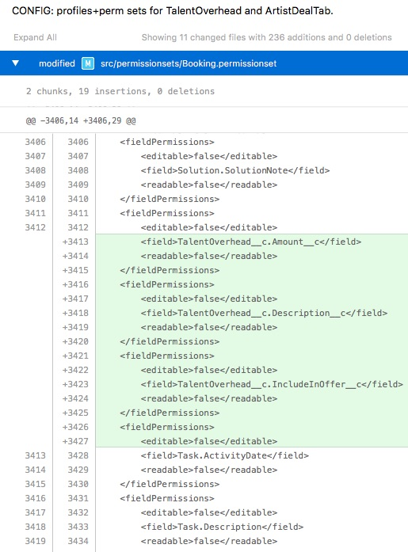

Please see the video found here:
[GDocs Refresh Profiles - November 1st,2016](https://drive.google.com/a/salesforce.com/file/d/0B1A8-6Ck12kLS0x1VmN1UHVWYmM/view?usp=sharing)

## GridBuddy

### GridBuddy Documentation

Please see the GridBuddy Customization guide for more information:
[https://drive.google.com/a/salesforce.com/file/d/0B3se-9TdqyRJYzF0TXhCV3ZfeUk/view?usp=sharing](https://drive.google.com/a/salesforce.com/file/d/0B3se-9TdqyRJYzF0TXhCV3ZfeUk/view?usp=sharing)

All GridBuddy Documentation can be found under the Documentation folder in gDocs:
[https://drive.google.com/drive/folders/0B1A8-6Ck12kLak13aWJpcUoxV0U?usp=sharing](https://drive.google.com/drive/folders/0B1A8-6Ck12kLak13aWJpcUoxV0U?usp=sharing)

### Creating GridBuddy Grids

** Please note that GridBuddy uses a single Static Resource to define the custom logic for any grid. It must use the same name as the Grid. **

For development purposes, or for additional functionality, additional Grids are occasionally needed.

1. Create a Grid Configuration within the GridBuddy app > Grids tab.  The name of the grid is imporant and will be used later on)
2. Create a Visualforce page to provide the GridFrame using the same name of the grid from Step 1. ( see **GBEmbed_AncillaryRevenues.page** for an example ) 
3. Create a visualforce page using the base Object that the page will leverage, referencing the page from step 2. ( See **LNE_AncillaryTab.page** for an example)
4. Within the Lightning ** App Builder **, navigate to the section and expose the visualforce page from step 3 within the layout.

### Customizing GridBuddy

Note that GridBuddy Grids have three main parts for customization:

** NOTE the grid name is very important and is the central theme for each grid.**

**1: - ** The GridBuddy configuration (under the GridBuddy app) / Grids: [ttps://lne--dev0--gblite.cs2.visual.force.com/apex/AllGrids?sfdc.tabName=01r360000011OH6](ttps://lne--dev0--gblite.cs2.visual.force.com/apex/AllGrids?sfdc.tabName=01r360000011OH6)

**2: - ** VisualForce page to expose the GridBuddy Grid:   ex: [https://lne--dev0.cs2.my.salesforce.com/066R0000000BAkT](https://lne--dev0.cs2.my.salesforce.com/066R0000000BAkT)

NOTE: GridBuddy creates template VisualForce pages through: More > Edit Settings | Embed Grid (button)

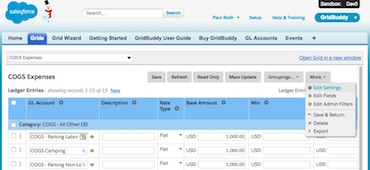

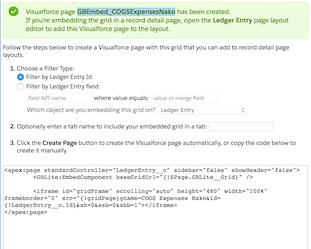

**3 - ** A GridBuddy Grid is often exposed out often through the SalesforceLightning App Builder - like the ancillaries section here:   [https://lne--dev0.lightning.force.com/visualEditor/appBuilder.app?pageId=0M0R000000000ZVKAY&cloneable=false&retUrl=%2fone%2fone.app%23%2fsetup%2fpage%3fnodeId%3dFlexipages%26address%3d%2f0M0R000000000ZV](https://lne--dev0.lightning.force.com/visualEditor/appBuilder.app?pageId=0M0R000000000ZVKAY&cloneable=false&retUrl=%2fone%2fone.app%23%2fsetup%2fpage%3fnodeId%3dFlexipages%26address%3d%2f0M0R000000000ZV)

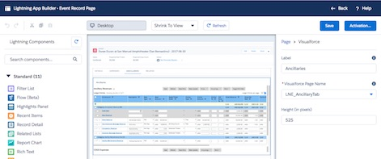

* A static resource (named the same as the grid) - and pulled in automatically by the grid. [https://lne--dev0.cs2.my.salesforce.com/081R00000009Si5](https://lne--dev0.cs2.my.salesforce.com/081R00000009Si5)

Additional information is forthcoming, but please see the Ancillaries grid / Static Resource for an example of much of the customization being used.

** For more information, please see the GridBuddy Customization Guide:
[https://drive.google.com/drive/folders/0B1A8-6Ck12kLak13aWJpcUoxV0U?usp=sharing](https://drive.google.com/drive/folders/0B1A8-6Ck12kLak13aWJpcUoxV0U?usp=sharing) **

.

### Creating a Developer Version of a GridBuddy Grid

GridBuddy (like mentioned above) uses a single static resource that is named the same as the Grid. This means that no two people can work on the same Grid at the same time.

Once you have a grid to work on, please perform the following:

**1: - ** Find the particular grid within the GridBuddy App > Grids Tab

[https://lne--dev0--gblite.cs2.visual.force.com/apex/AllGrids?sfdc.tabName=01r360000011OH6](https://lne--dev0--gblite.cs2.visual.force.com/apex/AllGrids?sfdc.tabName=01r360000011OH6)

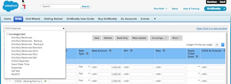

**2: - ** Navigate to More > Edit Settings

**3: - ** Click the `Clone` Button to clone the grid.

Use the same name of the grid but put in your name at the end:
(i.e. Ancillary Revenues to Ancillary Revenues Paul)

**4: - ** Navigate to the Grid Cloned From within SalesForce, and inspect the grid.
Find the URL for the iFrame that the grid Uses.

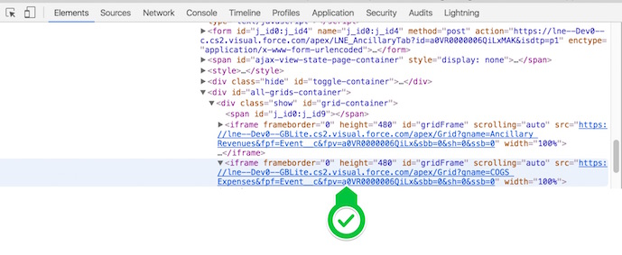

**5: - ** Replace the name of the Grid within the URL to your grid and open in a new tab.

i.e

	https://lne--Dev0--GBLite.cs2.visual.force.com/apex/Grid?gname=COGS Expenses&amp;fpf=Event__c&amp;fpv=a0VR0000006QiLx&amp;sbb=0&amp;sh=0&amp;ssb=0
	
becomes

	https://lne--Dev0--GBLite.cs2.visual.force.com/apex/Grid?gname=COGS Expenses Nako&amp;fpf=Event__c&amp;fpv=a0VR0000006QiLx&amp;sbb=0&amp;sh=0&amp;ssb=0

** You can now continue to work on your grid without conflicting with others. **

.

### Adding in Dirty Grid Protection

#### Overview

When users work with the grid, their changes are not imediately reflected in the database.

There is an element of usability 'safety' where they can work for quite a while, 
only to loose **all of it** because they navigated away or hit the delete key in the wrong spot.

This can be even further of an issue because of automated changes and the user may not even know they need to save.

#### How do we fix it?

There are two main areas that changes must be made.

** This must be done on every grid that requires protection **

##### VisualForce (page containing the grid)

**1. Add to the head of the VF page:**

	  

**2. When the DOM is ready in the init / bootstrapper function on the VF page, add:**

	lneSharedJs.handleFocusLoss(); 
		
If this is the only js on the page just ensure it runs at the end of the body markup or in a document ready block

**3. Add the following html attribute to the grid iframe:**

 		data-grid-name="" 

**NOTE: The grid name should be the same name you see in the gridbuddy iframe SRC EXCEPT - No spaces! All lower case!**
		
For example:

	        

	            <!-- Production/Miscellaneous Grid -->
	            <iframe id="grid-frame-productionmiscellaneous" data-grid-name="productionmiscellaneous" data-grid-visible="" scrolling="auto" height="480" width="100%" frameborder="0" src="{!gridPage}gname=Production-Miscellaneous&fpf=AdPlan__c&fpv={!Id}&sbb=0&sh=0&ssb=0"></iframe>
	        

#### Grid JavaScript

**1. Inside the document ready / main init / bootstrapper function:**

	gridSpecificHandleFocusLoss();

**REMINDER: the grunt compile will add the function to your grid specific file so it will be available.**

.

### Common GridBuddy Issues

Anyone please add to this,
just keep with the same format though please.

#### X: High level description

[additional description if needed]

**How to resolve:**

This is text

	indent to add code

**Additional Info:**

[Text for a link - ex markdown format](https://daringfireball.net/projects/markdown/syntax)

#### 1: I need to tell when a new GridBuddy row has been added

**How to resolve:**

	var newRowEl=jq("#gbMainTable tbody > tr.dr")[0];
	var newRow = jq(newRowEl);
	//ex: newRow.find( createFieldInputSelector( 'RecordTypeId' ))...

**Additional Info:**

There are two current ways to monitor for GridBuddy Rows:

* Using the [MutationObserver](https://developer.mozilla.org/en-US/docs/Web/API/MutationObserver) / [CanIUse](http://caniuse.com/#feat=mutationobserver)
* Monitoring click events on the 'new' button.

With a couple tests, it appears as though there is more complexity with using Mutation Observer, for now it appears as though jQuery solution is better in that it is more focused.

#### 2: The picklist options are incorrect b/c the default recordtype is wrong.

Said in a different way: a grid for 'Co-Promoters' are showing picklist options for the wrong / default record type ('Artist') - so the picklist options are wrong.

**How to resolve:**

* default the recordtypeid field
* dispatch a change() event on the input.

	jq("input.createNew[type=button]").on("click", function(){
		console.log( "new button was clicked" );
		//debugger;
		
		var newRowEl=jq("#gbMainTable tbody > tr.dr")[0];
		var recordTypeInput=jq(newRowEl).
			find( createFieldInputSelector( gridInfoByField.RecordTypeId.fieldName ));
		recordTypeInput.val( "Co-Promoter" ).change();
	});
	

**Additional Info:**

Issue is because of two things:

* one cannot set a default value (or a specific "default" record type) for a grid
* and picklist options are narrowed to only the object's record type default.

For example:

* if there is an object with two record types: 'A' and 'B'.

* 'A' has 8 picklist options enabled and is the default record type (for the object)

* 'B' has 2 picklist options enabled and is the record type we want for new records

* When a new record is created in the grid  
The record type is 'A' and picklist options reflect that (8)

* We want the 2 picklist options for 'B' instead.

.

### Setting up Grunt

**1: **
To create a static resource, please install nodejs/npm
[https://nodejs.org/en/download/](https://nodejs.org/en/download/)

**2: **
Then navigate to the [[checkout]]/resources folder and run:
`npm install`

**3: **
Then run the following command to make grunt available:
`npm install -g grunt`

(you can verify by running `grunt` within the resources folder and see the files recompile)

### Creating new Static Resources

Once you have created a grid, and you know the name of the grid (ex: 'Ancillary Revenue')

**1: **
Determine the name of the static resource: 
Please note that the name of the resource will be the name of your grid minus any spaces or special characters.

For example: If the name of the grid is 'Ancillary Revenues Temp', the resource name will be 'ancillaryrevenuestemp'

**2: **
Navigate to the [git checkout]/resources folder within your terminal and run the following command:

	grunt createGridBuddyResource:[[js or css]]:[[ name of the resource - step 1 ]]
	
for example:

	grunt createGridBuddyResource:js:ancillaryrevenuestemp
	
This will now update your [git checkout]/resources/Grunt_GRIDBUDDY_DEFINITIONS.js file with your resource, and will create the resource [git checkout]/resources/grunt_src/[[name of the resource]].js

**3: **
Update that file to your hearts content.

**4: **
Once the file has been created (and ready for updating), run:

	grunt

or

	grunt watch
	
See the section below on working with **Grunt Watch** for more information.
	
Note: the [git checkout]/src/staticresources/gbc\_[ resource name ]\_.resource has been created. 
Along with [git checkout]/src/resources/gbc\_[ resource name ]\_js.js

**5: **
Deploy that static resource as you would normally.

NOTE: If your username and password are not in `Grunt_SALESFORCE_CREDENTIALS.js` - deployments will fail. 
To setup 1. Run grunt createCredentials 
2. Edit the Grunt_SALESFORCE_CREDENTIALS.js with your specific info  

You can use Eclipse to deploy:  
[git checkout]/src/staticresources/gbc\_[ resource name ]\_.resource

or you can use grunt:  

	grunt deployGridBuddyResource:ancillaryrevenuestemp

This will deploy both the grid JS and CSS. 

(note: if this does not work, review the error message. Make sure you setup the credential file as described above also! )

### Grunt Watch ###

Grunt can compile in two ways:

	grunt
	
(this compiles everything)

or

	grunt watch
	
this will monitor any javascript or css files within the grunt_src folder.

If you make a change to them, it will recompile everything.

### Creating a GridBuddy API

GridBuddy is currently customized within a Static Resource that is within a separate domain.

This causes a couple issues in terms of CORS (because browsers block data across domains) and there is no access to the API Access Token.

Calls are currently made as a visualforce page (but I'm curious if it is possible through a remoting / custom API call, @TODO)

Simply make a Visualforce page that will accept the request
and pass the information to the controller
to return it back as a JSONP response. (This is how we get around the cross domain aspect)

See the call from the static resource from ancillary revenues static resource:
[https://lne--dev0.cs2.my.salesforce.com/081R00000009Si5](https://lne--dev0.cs2.my.salesforce.com/081R00000009Si5)

the endpoint visualforce page: LNE_GridBuddyCalculationAPI (@TODO: that name needs to be fixed)
[https://lne--dev0.cs2.my.salesforce.com/066R0000000BBrk](https://lne--dev0.cs2.my.salesforce.com/066R0000000BBrk)

the underlying controller:
[https://lne--dev0.cs2.my.salesforce.com/01pR0000000Ip9F](https://lne--dev0.cs2.my.salesforce.com/01pR0000000Ip9F)

The two main points of interest are the calls for the API

and the controller to work through the logic

# Creating a gridbuddy button

### Step 1: find the appropriate grid**

You can easily find all grid buddy grids from the "GridBuddy" app
and navigating to the Grid Tab

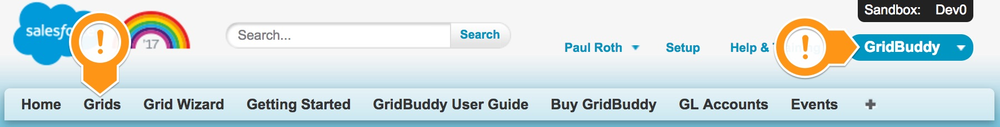

From there you can do a search for a grid, such as the following:

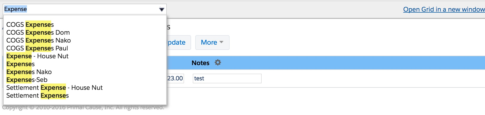

### Or find the grid from inspector

Right click on a grid and find the URL of the containing iframe within the source

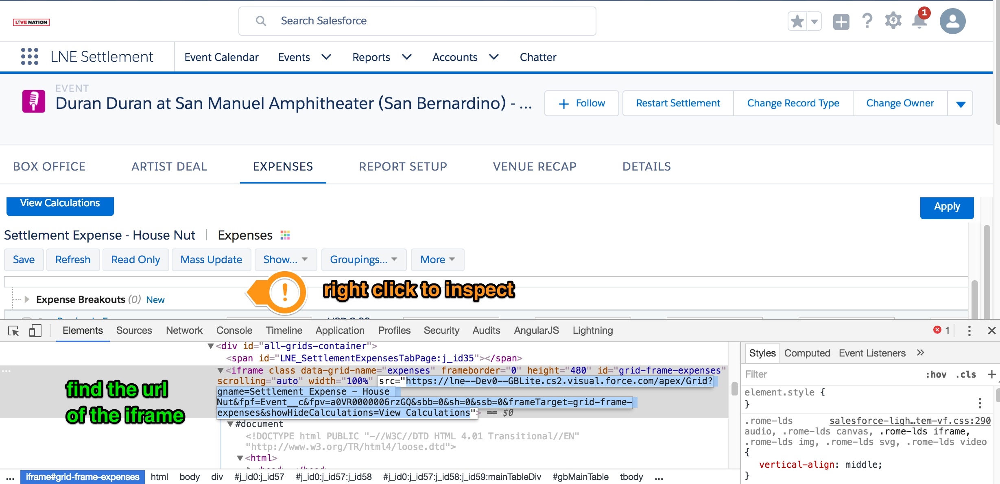

### Step 2: navigate to the actions

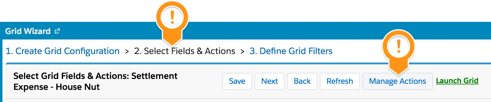

That will allow you to create a globally avaiable button  
(note you still need to configure the button to appear on the grid)

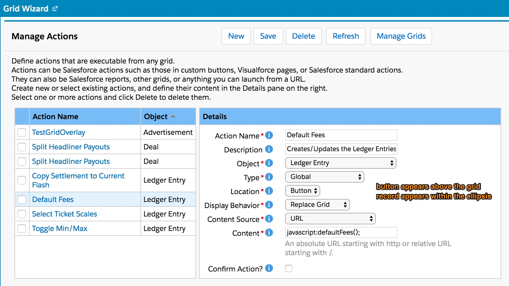

### Step 3: apply the button to the grid

Go back within Settings > select Actions and Fields  
scroll down to the bottom and  
Select the action to appear within the grid.

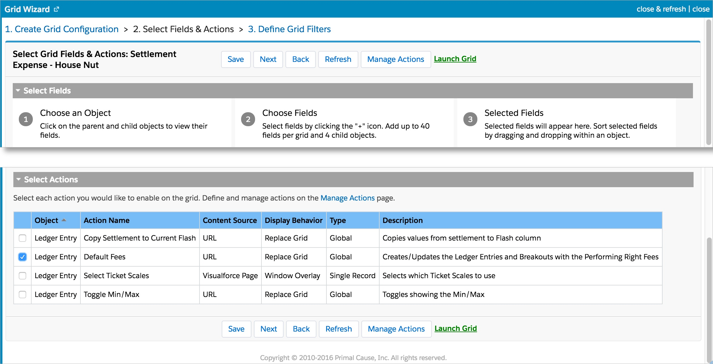

# Debugging/Troubleshooting Flows

Oh. No.

You have an unhandled flow exception.

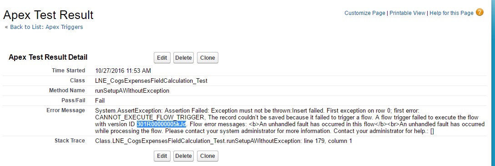

###### How can we tell which Flow it is thats causing the issue?

Unfortunately, flows aren't available within standard SOQL, but they are available within the Tooling API.

[Aside.io](https://www.aside.io) is an online Salesforce development tool that allows you to perform Tooling Queries.

Navigate to the 'Data' section in the top right and use the following query: 
(Substituting your FlowId)

	select id, FullName, description from flow where id ='[[ Offending Flow Id ]]'

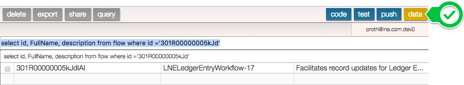

** OR ** - Run the following from the REST API in Workbench:

	/services/data/v34.0/tooling/sobjects/flow/[[ Offending Flow Id ]]

###### Debugging the Issue

To debug the issue, the easiest way is to set a new debug line on your current user, and set the debug settings to the Finest levels for all settings.

Please note that when you open Aside, it automatically will create a new Debug line for your user - HOWEVER, you will still need to go to the debug settings (for that line) to set the appropriate Debug Level (called 'FINEST' in each environment.)

	09:34:16.76 (18078035406)|VALIDATION_FORMULA|!$Setup.GeneralSettings__c.BypassAutomation__c &&
	OR( 
	BillingStreet = NULL, 
	BillingCity = NULL,  
	BillingState = NULL, 
	BillingCountry = NULL, 
	BillingPostalCode = NULL) 
	
	&&  OR(RecordType.DeveloperName = "Agency", RecordType.DeveloperName = "Office", RecordType.DeveloperName = "Venue")|BillingCountry=United States , BillingStreet=1000 west illinois st , BillingCity=Chicago , RecordType.DeveloperName=Venue , BillingPostalCode=60402 , $Setup.GeneralSettings__c.BypassAutomation__c=null , BillingState=null

Note how the log shows both the formula that failed and the values that were sent.

Int this case the **BillingState** is set to null, and that was why we had the issue.

# Styling

### Grid Styling

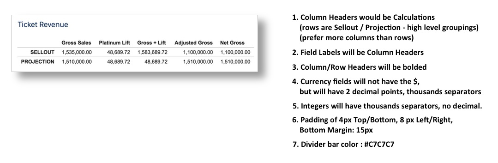

# Display Calendar Anything Filters

To show the Filters for Calendar Anything, simply go to:

** Calendar > My Calendar > Display Settings**

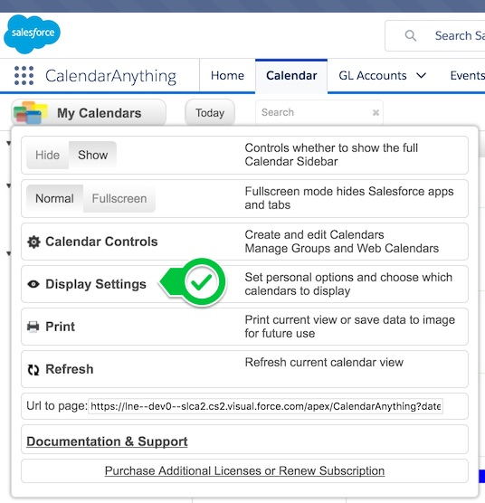

** Under 'My Display Settings' select 'Display Filter Panel' checkbox **

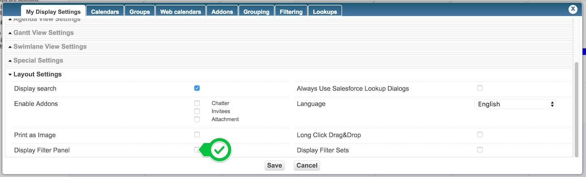

You should now see the filters on the left hand side:

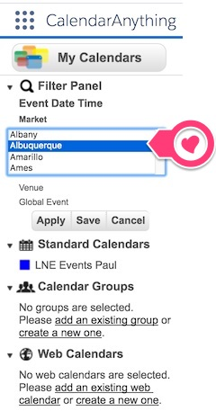

For more information, please see the [Release Notes for Calendar Anything](https://drive.google.com/a/salesforce.com/file/d/0B3se-9TdqyRJaV9XeW9RT3U2Rnc/view?usp=sharing)

# JSON2APEX (Accepting JSON from Apex)

##### Step 1: get example JSON data to parse
This can be from calling the API, such as:

[http://api.livenation.com/artists/44259/events/](http://api.livenation.com/artists/44259/events/)

##### Step 2: Navigate to JSON2Apex

[https://json2apex.herokuapp.com/](https://json2apex.herokuapp.com/)

It is not necessary to include all results, only a single one is needed (it can be cleaned up within the class if needed.

Running generate will download a zip of:

* the Class
* the Test for that class

ex:

* LNE\_API\_EventSearchResp.apxc
* LNE\_API\_EventSearchResp\_Test.apxc

##### Step 3: Massage the Class (Optional)

If you'd like, cleanup the Class to change types (Numbers to String,etc)

##### Troubleshooting

The following are some problem code generated bythe tool

If you see the following:

Change:

	new String(parser)

to

	parser.getText();
	
Change:

	new Object(parser);

to

	parser.getText();

# Testing API Calls

There are three main types of API calls that can be used within LiveNation:

* JSONP call that is used from GridBuddy to support external logic/data
* Salesforce API calls
* LiveNation / TicketMaster / external API calls

Current understanding is that all of these API calls utilize JSON in their response (JSONP being the slight difference in that it uses JavaScript with POJO objects)

To help work with JSON data, please see the following chrome extensions

### JSON Formatter

[https://chrome.google.com/webstore/detail/json-formatter/bcjindcccaagfpapjjmafapmmgkkhgoa?hl=en](https://chrome.google.com/webstore/detail/json-formatter/bcjindcccaagfpapjjmafapmmgkkhgoa?hl=en)

When loading a page with JSON, it automatically will format it to become legible.

Note, the only way to use this though, is if you have a page you can receive JSON from.

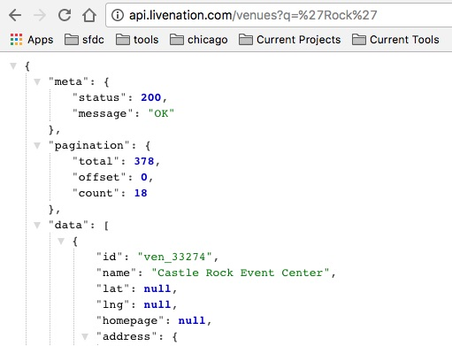

### JSON Editor
[https://chrome.google.com/webstore/detail/json-editor/lhkmoheomjbkfloacpgllgjcamhihfaj](https://chrome.google.com/webstore/detail/json-editor/lhkmoheomjbkfloacpgllgjcamhihfaj)

Similar to the JSON Formatter, although this allows ways to edit JSON
in addition to formatting it.

Note this can be used at any time, regardless of whether there is a page to receive the JSON from or not.

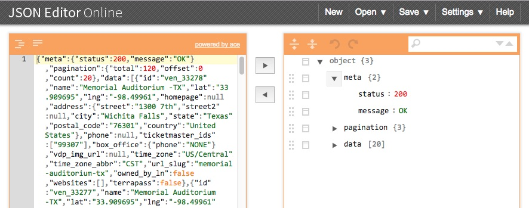

### Testing REST API calls (DHC/Restlet)

Simple tool for creating / testing API calls

Import the Restlet Repository : DHC_LiveNationAPI.json  
(found at the base of the repo)

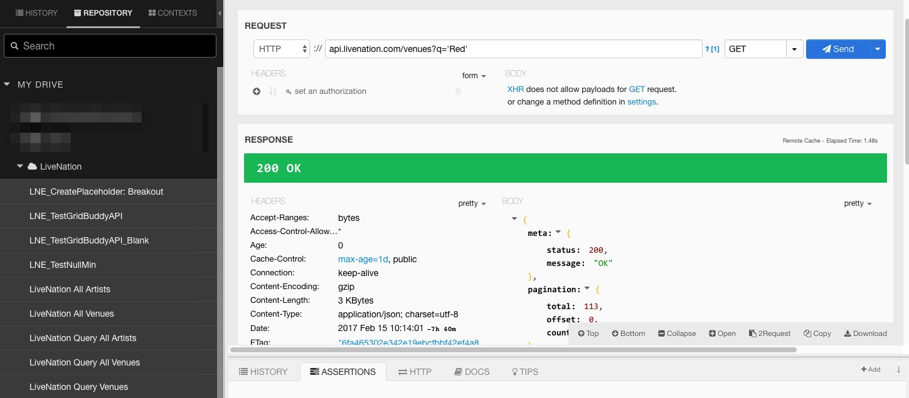

#### Importing

After you have restlet installed, you can open it up within the list of Chrome Apps

Then under 'Import' (near the bottom left of the page)  
Select 'Import Restlet Client Repository'  

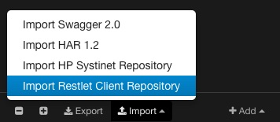

And use the `DHC_LiveNationAPI.json` file found at the base of the git repository.

* LNE_TestGridBuddyAPI - example call using JSONP to execute APEX from a separate domain
* LiveNation All Artists - LiveNation API for all artists
* LiveNation All Venues
* LiveNation Query Artists - Method to query artists from LiveNation API
* LiveNation Query Venues
* LiveNation Query Events

#### Exporting
Have a new call?
Great!
Simply paste the URL (and add any additional paramters to the request if needed)
And click 'Save' button  
(save it with a name that makes the most sense within the LiveNation group)

**Then** Click the export button and overwrite / VersionControl just the LiveNation group to the **DHC_LiveNationAPI.json** found at the base of the repo.

# Bypassing Functionality

## De Dupe Rules

There are only two De-Duping rules currently in use: Account and Contact.  Both can be handled under Setup > Duplicate Rules

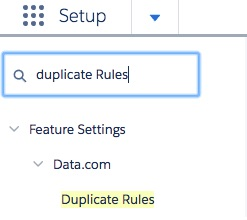

Simply Click the Deactivate button to deactivate temporarily, but be sure to activate again when you are done.

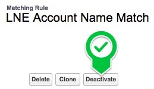

If you feel you need it deactivated for longer periods of time, please contact [Paul Roth](mailto:proth@salesforce.com), [Henry Akpala](mailto:makpakpala@salesforce.com) or [mreid@salesforce.com](mailto:mreid@salesforce.com)

#### Account 

Account dedupes based on the fuzzy Company Name on the Account (blank company names do not apply)

#### Contact

Please note: this is currently not activated...
[Standard Contact Matching rules apply](https://help.salesforce.com/articleView?id=matching_rules_standard_contact_rule.htm&r=https%3A%2F%2Fhelp.salesforce.com%2Fapex%2Fhtdoor%3Floc%3Dhelp%26target%3Dmatching_rules_standard_contact_rule.htm%26language%3Den_US%26release%3D206.12%26instance%3DCS63&siteLang=en_US&type=0)

## Automated Processes

There are four main areas of bypass:

* Do not run Triggers
  * Do not run Financial Calculator (subset of Triggers)
* Do not run Flows
* Do not run Process Builders Processes
  * Do not create Objects on Event Creation (subset of Flows)

The support for bypassing functionality is kept at the 'General Settings' Custom Setting. (Found by Setup > Custom Settings)

There are four major levels of Automated Process Bypass:

* Bypass Automation (bypasses all levels)
* Bypass PB (Process Builder)
* Bypass Financial Calculator
* Bypass Event Object Creation (possible)

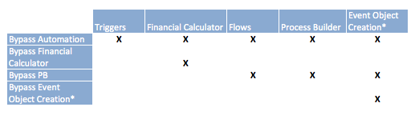

### Per Role

Long term bypassing is provided at specific role / profile levels (such as by the Integration Process - as it brings records over already transformed)

This can be managed through the Manage button on the custom setting.

### Transactional

Short term bypassing is granted at a user level and only within code.

This is currently done exclusively within the Clone process (as we do not need to calculate values). If there are other possible candidates, please reach out to Paul before continuing.

There are two methods available:

	/**
	 *  Specifies which permissions the current user should be able to bypass
	 *  @param bypassProcessBuilder (Boolean)
	 *  @param bypassAutomation (Boolean) - bypass all triggers and process builder functionality (including financial calculator)
	 *  @param bypassFinancialCalculator (Boolean) - bypass the financial calculator
	 *  @return Boolean - success (true) or failure (false)
	 **/
	LNE_GeneralSettingsUtil.setLocalBypassSettings( Boolean bypassAutomation, Boolean bypassProcessBuilder, Boolean bypassFinancialCalculator ):Boolean

[Link to Method](https://www.aside.io/?file=LNE_GeneralSettingsUtil.cls&find=setLocalBypassSettings)

and

	/**
	 *  Attempts to remove the current user's general setting override.
	 *  @return Boolean - whether successful (true) or not (false)
	 **/
	LNE_GeneralSettingsUtil.removeCurrentUserOverride():Boolean
	
[Link to Method](https://www.aside.io/?file=LNE_GeneralSettingsUtil.cls&find=removeCurrentUserOverride)
	
Please note that setting local bypass will overwrite any values currently set for the user, but all other settings will remain in tact.

With any code that uses it, please ensure that a `finally` block is utilized to ensure that the override is removed.

# Windows Tools

* Git Tower
* Eclipse / Salesforce IDE
* DiffMerge

# Drawloop

## Make a Drawloop Document

See the resources here:
[DrawLoop Documentation](http://help.nintex.com/en-us/docgen/docservices/Default.htm#docgen-sfdc/Services/templates/t_documentSetup.htm%3FTocPath%3DWork%2520with%2520the%2520basics%7CSetup%2520templates%7C_____0)

## Making a Button for LEX

**1. Navigate to the 'Nintext Drawloop' app**

**2. Navigate to the 'Drawloop Admin' tab**

**3. Choose Advanced Options (for now) and complete the button.**

**4. Cut the URL generated from the button and put it within a placeholder visualforce page**

Use the following as a template:

	<!--
	/**
	 * Page to run drawloop within LEX.
	 * @author Paul Roth <proth@salesforce.com>
	 * /apex/page_name?id=_example_id_
	**/
	-->
	<apex:page standardController="Event__c_or_other_object"
	action="http_address_cut_from_the_button_target">
	</apex:page>
	
**5. Save the page**

**6. Update the existing button - set Content Source: Visualforce**

Direct to the visualforce page you just made.

**7. Update the page layout to include the button**

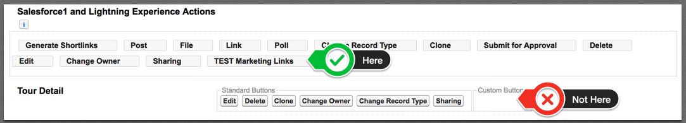

## Dynamic Downloads

**1. Create DDP with initial version of the document**

**2. Create multiple Delivery options**

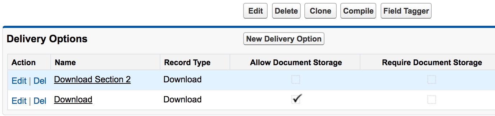

**3. Navigate to the 'Field Tagger' to find deliveryname**

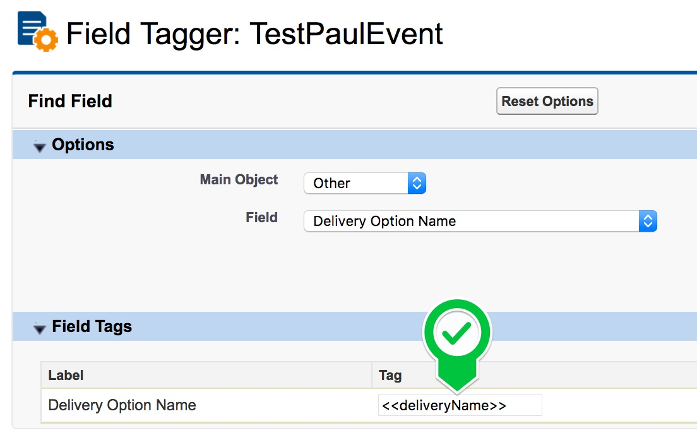

**4. Use that tag to specify conditions within document**

[Drawloop Documentation](http://help.nintex.com/en-us/docgen/docservices/Default.htm#docgen-sfdc/Services/templates/ConditionalTextWord.htm?Highlight=conditional)

**5. Upload the updated doc**

**6. For any specific condition, find the Delivery Id**

Navigate to the Delivery record, and get the Id within the URL.

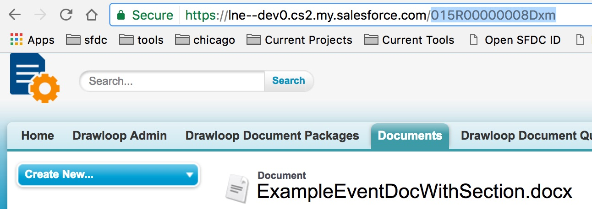

**7. Update the URL to include the Delivery Id**

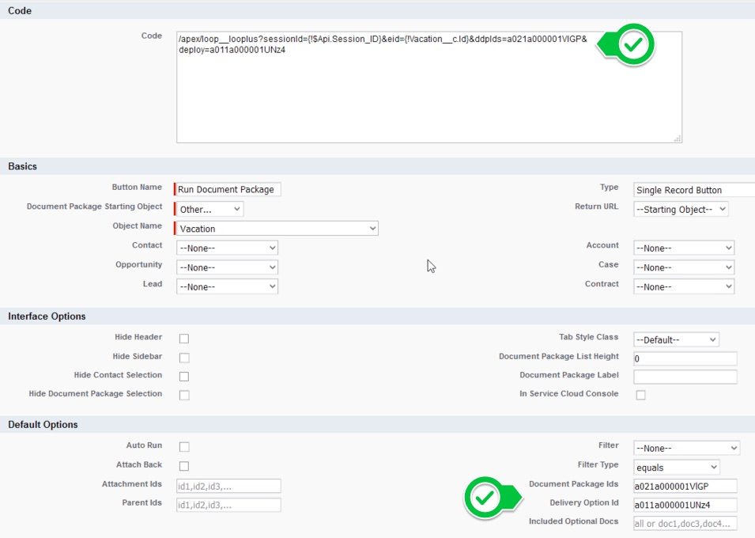

# Working with Git

* Please use the git Commit / git Compare bookmarklets and send the URL to pauly.