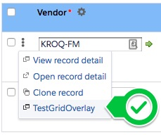
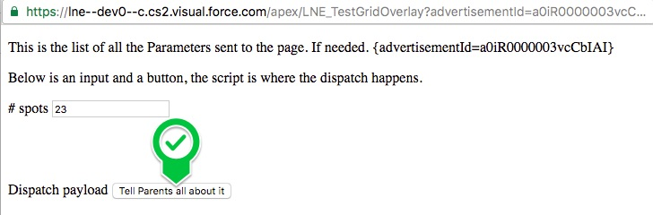
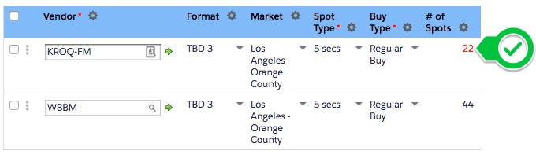
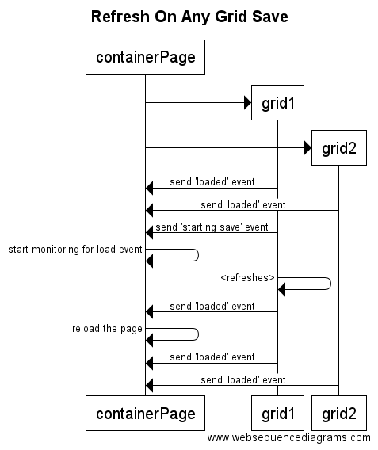

# Code Support / Best Practices

The point of this section is for any Best Practices / common issues found
and ways to get around it.

** If this needs to be recompiled to a PDF - please let Pauly know **

## Getting RecordType IDs

Getting a RecordType Id / matching RecordTypes is fairly common.

Say that you needed to create a LedgerEntry that was of recordType 'COGS'
and a LedgerEntryBreakout of recordType 'Shadow'

Please use the LNE_Utils to find this info:

For example:

	//-- follows the format of '[[object name]].[[record type developer name]]'
	
	public static final string RT_COGS = 'LedgerEntry__c.COGS';
	public static final string RT_SHADOW = 'LedgerEntryBreakout__c.Shadow';
	
	Map<String,Id> recordTypeMap = LNE_Util.getRecordTypes(
        new String[]{ RT_COGS, RT_SHADOW }
    );

    Id RT_COGS_ID = recordTypeMap.get( RT_COGS );
    Id RT_SHADOW_ID = recordTypeMap.get( RT_SHADOW );
    
## Getting Permission Sets / Profiles

The same way that we get the RecordType Ids can be used for Permission Sets and Profiles,
just please note that it uses the NAME of the Profile (since there is no developer name).

	public static final string PROF_ADMINISTRATOR = 'System Administrator';
	public static final string PROF_INTEGRATION = 'LNE Integration';
	public static final string PROF_INTERNAL_USER = 'LNE Internal User';
	
	Map<String,Id> profileMap = LNE_Util.getProfileIds(
		new String[]{ PROF_ADMINISTRATOR, PROF_INTEGRATION, PROF_INTERNAL_USER }
	);
	
	ID administratorProfileId = profileMap.get( PROF_ADMINISTRATOR );
	ID integrationProfileId = profileMap.get( PROF_INTEGRATION );
	ID internalProfileId = profileMap.get( PROF_INTERNAL_USER );'
	
same idea for permission sets.

## Determining Changes for Triggers

For all Triggers - especially on updates - we only really care about are records that have changed to become a condition (or not)

To simplify this, we made a new Object called LNE_SObjectChange to help with this.

For example:

	//-- only assume it is valid if the Billing Postal Code or State Code or City have changed
	//-- even if it is a new record
	
	if( oldAccount == null ) oldAccount = new Account();
	objChange = new ChangedAccount( oldAccount, newAccount );
	
	if(
		objChange.notEqualsStr( 'BillingPostalCode',false ) ||
		objChange.notEqualsStr( 'BillingStateCode',false ) ||
		objChange.notEqualsStr( 'BillingCity',false )
	){
		isValid = true;
	} else {
		System.debug( 'is valid venue but no postal change' );
	}

Here is more of a complete example:

	//-- ONLY needed because we don't want to convert and generics are not supported in Apex
	class ChangedAccount extends LNE_SObjectChange {
		ChangedAccount( Account oldObject, Account newObject ){		    super( oldObject, newObject );
		}
		
		Account getNewAccount(){
			return( (Account)this.newObject );
		}
		
		Account getOldAccount(){
			return( (Account)this.oldObject );
		}
	}
	
	public static Account[] execute( Account[] newList, Map<Id,Account> oldMap ){
		ChangedAccount[] changedAccounts = new ChangedAccount[]{};
		ChangedAccount objChange = null;
		
		Boolean isValid = false;
		Account BLANK_ACCOUNT = new Account();
		
		//-- loop through all accounts to only those that qualify
		for( Account newAccount1 : newList ){
		    isValid = false;
			oldAccount = null;
			
			if( RT_VENUE_ID == newAccount1.RecordTypeId ){
                //System.debug( 'is an venue' );
                if( oldMap.containsKey( newAccount1.Id )){
                    //System.debug( 'old venue' );
    				oldAccount = oldMap.get( newAccount1.Id );
    				objChange = new ChangedAccount( oldAccount, newAccount1 );
    				
    				//-- if the record type is correct and the fields have changed.
    				//-- assumes the billing address is required
    				if(
    					objChange.notEqualsStr( 'BillingPostalCode',false ) ||
    					objChange.notEqualsStr( 'BillingStateCode',false ) ||
    					objChange.notEqualsStr( 'BillingCity',false )
    				){
    					isValid = true;
    				} else {
    					System.debug( 'is valid venue but no postal change' );
    				}
    				
    			} else {
                    //System.debug( 'new venue' );
    			    oldAccount = BLANK_ACCOUNT;
    			    objChange = new ChangedAccount( oldAccount, newAccount1 );
    			    
    			    isValid = true;
    			}
    			
    			if( isValid ){
    				//-- trigger is good. keep it going
    				newAccount.SetSomeField=true;
    				changedAccounts.add( newAccount );
    			}
    		}
    	}
    	
    	return( changedAccounts );
    }

## Test Templates

For all unit tests please use the LNE_TestTemplate_Test as a base:

	@isTest
	private class LNE_TestTemplate_Test {
	
		class TestSettings {
			
			
			public TestSettings() {
				//-- global setup here
			}
			
			//-- whatever your setups, and you can make it as varied as you'd like.
			public void typicalSetup(){
			}
			
			public void finalize(){
				//-- always should be called.
			}
		}
		
		
		//-- test setups here to find out if errors have nothing to do with the test.
		
		static testMethod void runSetupAWithoutException() {
			TestSettings ts = new TestSettings();
			ts.typicalSetup();
			ts.finalize();
			System.assert( true, 'No Exceptions have occurred in getting here' );
		}
		
		//-- test functionality here
		
		static testMethod void testScenario() {
			TestSettings ts = new TestSettings();
			ts.typicalSetup();
			ts.finalize();
			
			//-- your logic off of any info from TS here
			System.assert( true, 'ts.account.DMA__c is not null, etc.' );
		}
	
	}

This provides a number of really cool things:

* This provides a setup / teardown type of model from standard JUnit / NodeUnit setups
* All setups are completely repeatable and separate from the test, so extending tests is super easy.
* Multiple types of setups are available, that can even be parameterized.
* Common functions used in multiple areas are separate - like refreshAccounts( Account[] )
* Setups can even build upon one another - like insertSingleVenue() and updateSingleVenue()

For example:

	@isTest
	private class LNE_Example_Test {
		
		class TestSettings {
			
			//-- example combined key delimiter
			String COMBINED_KEY_DELIMITER = '|';
			
			Account geoOffice;
			Account divisionOffice;
			
			LNE_TestObjectFactory factory;
			
			public TestSettings(){
				//...
			}
			
			/** Confirms the accounts are valid **/
			public void confirmAllAccounts(){
				//...
			}
			
			public void setupSingleVenue(){
				//...
			}
			
			/** Setup that creates and the has an update to the Account **/
			public void setupSingleVenueUpdate(){
				setupSingleVenue();
				//...
			}
			
			/** Finalize step. Should always be called after all setups. **/
			public void finalize(){
			}
		}
	
		//-- test test methods here
		static testMethod void runSimpleAccountsWithoutException() {
			TestSettings ts = new TestSettings();
			ts.setupSingleVenue();
			ts.finalize();
			System.assert( true, 'No exceptions were thrown' );
		}
		
		//-- test functionality here
		static testMethod void verifyInsertMatchByCityState(){
			TestSettings ts = new TestSettings();
			ts.setupSingleVenue();
			ts.finalize();
			
			Account[] results = LNE_AccountDMA_Autoassign_T.execute( ts.newAccounts, ts.oldAccountsMap );
			
			System.assertNotEquals( null, results, 'AutoAssign must have some results when a valid Zip code is provided' );
			System.assertEquals( 1, results.size(), 'Since one account was created, there should be one account auto assigned' );
			
			Account updatedAccount = results[0];
			System.assertEquals( ts.dmaList[1].DMA__c, updatedAccount.DMA__c, 'JACKSON-IL should map to PADUCAH-CAPE/Jackson' );
		}
	}

** Without having to know anything about how the setup was created - because that isn't part of the test. We know that it created a single venue, that it executed the code, there must be at least one result and that 'JACKSON-IL should map to PADUCAH-CAPE/Jackson' **

*Thats pretty sweet*

If you'd like to dig a bit deeper, please look at the `LNE_AccountDMA_Autoassign_T_Test`
or let us know how we could do it better.

## Creating Test Objects

Wouldn't you know it, you'll need to create objects to test with.

Please use / update the LNE_TestObjectFactory for your tests in creating things.

There are three different ways to work with objects, and all of them are supported:

**1: - ** Simple constructor.

	testDMA = LNE_TestObjectFactory.createDMA( 'CHICAGO', 'Chicago', 'IL', '60402' );
	
This is great for objects that don't have many arguments.

Although it can get really confusing - like in this example, **WHY IS CHICAGO IN THERE TWICE?**

If you need to extend it, you can always overload the constructor, but the same issue applies.

.

**2: - ** LNE_TestObjectFactory builder.

The LNE_TestObjectFactory is an object factory that can perform additional builds on top of standard objects for things that aren't as common - and as a way to make more sense of the changes requested.

For example:

	LNE_TestObjectFactory factory = new LNE_TestObjectFactory(null);
	...
	Account myAccount = new LNE_TestObjectFactory.createAccount( 'testGeography', RT_OFFICE_ID );
	factory.importObj( myAccount )
		.addBillingAddress( '1000 west illinois st', 'Chicago', 'Illinois', 'IL', '60402', 'United States' )
		.setPhone( '555-867-5309');
	
	//-- passes
	Systm.assert( myAccount.BillingStateCode, 'IL');

is much more descriptive and helps to describe things easier.

Note, if you want to include it in building a list of multiple objects, you may need to include the 'buildAccount' method

	LNE_TestObjectFactory factory = new LNE_TestObjectFactory(null);
	...
	Account[] myAccounts = new Account[]{
		factory.importObj(
			LNE_TestObjectFactory.createAccount( 'Geography' ), RT_OFFICE_ID )
		)
			.addBillingAddress( '1000 west illinois st', 'Chicago', 'Illinois',
				'IL', '60402', 'United States' )
			.addPhone( '555-867-5309' )
			.buildAccount(),
		
		factory.importObj(
			LNE_TestObjectFactory.createAccount( 'Geography2', RT_OFFICE_ID )
		)
			.addBillingAddress( '1000 west illinois st', 'Chicago', 'Illinois',
				'IL', '60402', 'United States' )
			.addPhone( '555-867-5309' )
			.buildAccount()
	};
	
** If, however, the kind of setup is always required, folding those into the constructor is totally fine if it makes sense **

.

**3: - ** Add individual properties

Sometimes, instead of creating a new builder for each and every set of property needed, we can add it in as a properties builder instead.

Simply pass a map of the property (as a key) and the value and they will be assigned over.

	LNE_TestObjectFactory factory = new LNE_TestObjectFactory(null);
	...
	Account myAccount = new LNE_TestObjectFactory.createAccount( 'testGeography', RT_OFFICE_ID );
	factory.importObj( myAccount )
		.addprops( new Map<String,Object>{
			'BillingStreet' => '1000 west illinois st',
			'BillingCity' => 'Chicago',
			'BillingState' => 'Illinois',
			'BillingStateCode' => 'IL',
			'BillingPostalCode' => '60402',
			'BillingCountry' => 'United States',
			'Phone' => '555-867-5309' });

If you need to set a bunch of objects all the same, then it can be done that way too:

	String billingStreetAddress = '1000 west illinois st';
	Map<String,Object> allProps = new Map<String,Object>{
		'BillingStreet' => billingStreetAddress,
		'BillingCity' => 'Chicago',
		'BillingPostalCode' => '60402',
		'BillingState' => 'Illinois',
		'BillingStateCode' => 'IL',
		'BillingCountry' => 'United States'
		//-- any additional props here
	};
	
	Account[] testAccounts = new Account[]{
		LNE_TestObjectFactory.createAccount( LNE_TestObjectFactory.makeUnique( 'testAccount' )),
		LNE_TestObjectFactory.createAccount( LNE_TestObjectFactory.makeUnique( 'testAccount' )),
		LNE_TestObjectFactory.createAccount( LNE_TestObjectFactory.makeUnique( 'testAccount' )),
		LNE_TestObjectFactory.createAccount( LNE_TestObjectFactory.makeUnique( 'testAccount' )),
		LNE_TestObjectFactory.createAccount( LNE_TestObjectFactory.makeUnique( 'testAccount' )),
		LNE_TestObjectFactory.createAccount( LNE_TestObjectFactory.makeUnique( 'testAccount' )),
		LNE_TestObjectFactory.createAccount( LNE_TestObjectFactory.makeUnique( 'testAccount' )),
		LNE_TestObjectFactory.createAccount( LNE_TestObjectFactory.makeUnique( 'testAccount' ))
	};
	
	LNE_TestObjectFactory factory = new LNE_TestObjectFactory( null );
	for( Account testAccount: testAccounts ){
		factory.importObj( testAccount ).addProperties( allProps );
	}
	
## Communicating Across Windows

GridBuddy, because it is a Managed Package, works within a separate domain:

i.e. https://**lne--dev0--gblite.cs2.visual.force.com**/apex/AllGrids
instead of standard salesforce:

https://**lne--dev0.cs2.my.salesforce.com**/p/setup/custent/CustomObjectsPage?setupid=CustomObjects

Whenever the container page needs to communicate with a grid, such as:

* Determine if a grid is dirty / has unsaved changes in it
* Must be directed to save from the parent page
* Needs to be updated based on info from the parent page / popup

There will normally be many things that will be blocked due to security from working across domains.

To get around this we have been using [window.postMessage](https://developer.mozilla.org/en-US/docs/Web/API/Window/postMessage)

Below is example documented code and a walkthrough of how they work together.

*Unfortunately, the very reason it is is put into a separate domain - for security buffer - is exactly the reason why we cannot setup CORS - so CORS is not available at this time.*

#### LNE_PostMessage

LNE_PostMessage is a JavaScript ES6 class that provides a way to send a message from one window to another.

By creating the LNE_PostMessage, you can dispatch that event to another window and then receive and parse to have the exact same message dispatched.

It also provides additonal helper functions to specify the page it was sent from, and message type - along with filter functions to validate on the receiving side.

The LNE_PostMessage is available from any visualforce page by including:

	<apex:includeScript value='{!URLFOR($Resource.LNE_GeneralResources,"js/events/LNE_PostMessage.js")}' />

Conversely, to access it from any GridBuddy JS resource, a brief change is needed in the `Grunt_GRIDBUDDY_DEFINITIONS` file.  Simply change the 'beforeSrc' attribute to `eventReceiverScripts`. For example:

		radiotestgridoverlay: {
			src: 'grunt_src/radiotestgridoverlay.js',
			beforeSrc: eventReceiverScripts
		},
		
Example dispatch:

	var pageName = 'LNE_TestPostMessage';
	var method = 'saveAttempted';
	var isSuccessful = true;
	var data = { userId: 'someId', someSetting: 23 };
	var m = new LNE_PostMessage( pageName, method, isSuccessful, data );
		
To receive events, all that is needed is to listen for 'message' events on the window:

	//-- all postMessages are dispatched as window level events
	//-- of type 'message'
	window.addEventListener( "message", handleResultDispatch, false );
	
	function handleResultDispatch( evt ){
		var postMessage = LNE_PostMessage.parse( evt );
		
		if( postMessage ){
			postMessage.matchesPageMessage( 'LNE_TestPostPage','saveAttempted' )){
			console.log( 'user:' + postMessage.data.userId );
			console.log( 'someSetting:' + postMessage.data.someSetting );
		}
	}

for more info, please see: [https://developer.mozilla.org/en-US/docs/Web/API/Window/PostMessage](https://developer.mozilla.org/en-US/docs/Web/API/Window/PostMessage)

#### LNE_PostMessage methods

###### constructor( pageName:String, messageType:String, isSuccessful:Boolean, payload:Object|String )

	 Constructs an LNE Post Message (payload).
	 @param pageName - String - name of the page
	 @param messageType - String - arbitrary name of the message type to be sent.
	 @param isSuccessful (Boolean) - whether the call was successful or not
	 @param payload (String|Object) - payload to be provided (will be converted to string)

##### dispatch( targetWindow:Window, targetDomain:String = '*' ):void

	 Dispatches the event.
	 @param targetWindow (Window) - target window to dispatch from. i.e. parent
	 @param targetDomain (String) - target domain to accept the request, defaults to '*'
	 @return void
	 
##### LNE_PostMessage.parse( evt:PostMessageEvent ):LNE_PostMessage

	 Parses a dispatched Event
	 @param evt (postMessage Event)
	 @return payload (Object) - instance of the LNE PostMessage (if applicable) - null if not.

##### LNE_PostMessage.getMessageOrigin( evt:PostMessageEvent ):String

	 Determines the origin of a PostMessage event.
	 @return String
	 
##### matchesPageMessage( pageName:String, messageType:String ):boolean

	 *  Whether it matches both the page and the message type
	 *  @param pageName (String)
	 *  @param messageType (String)
	 *  @return boolean - whether the pageName and the messageType both match in a case insensitive manner.

#### LNE_MessagePostOffice

LNE_MessagePostOffice is a JavaScript class that provides a very simple way to monitor PostMessages (but mostly geared for managing LNE_PostMessage2 messages )

To listen for LNE_PostMessage2 post messages, all that is needed is the following:

**1: Create an instance of the postOffice**

	//-- instantiate with the scope object (to represent 'this' in any handling)
	this.postOffice = new LNE_MessagePostOffice(this);
	
**2: Add event listener for any LNE_PostMessages based on messageType **

	this.postOffice.addTypeHandler( 'testMessages', function( postMessage ){
		//-- @invariant: an LNE_PostMessage2 was received and has 'messageType' = 'testMessage';
		//-- @invariant: the EXACT object provided in LNE_PostMessage2.data is available here
		//-- as postMessage.data
	)

Repeat this for as many messageTypes as you would like to handle.
	
**3: Optional: add handler for any postMessage that the type is not recognized for**

	this.postOffice.addTypeHandler( null, function( postMessage ){
		console.error( 'an unknown postMessage.type was received:' + postMessage.messageType );
	});
	
**4: Listen for postMessages on the window**

	this.postOffice.listenForPostEvents( window );
	
For an example page that communicates please see

/apex/TEST_PostMessageParent

#### LNE_MessagePostOffice methods

###### constructor( scope:Object )

	 Constructs an LNE Message Post Office
	 example: this.postOffice = new LNE_MessagePostOffice(this);
	 @param scope - Object - The object that represents 'this' within the handlers.

##### addTypeHandler( messageType:[null|string], handler:function ):void

	 Handler for any LNE_PostMessage2 post event that has a matching message type. (or catchall handler if null)
	 example: this.postOffice.addTypeHandler( 'testMessage', function(postMessage){} );
	 @param handler (function(LNE_PostMessage2)) - function that will execute
	 @return void
	 
##### listenForPostevents( window:Window ):void

	 Initiates the PostOffice for listening for PostMessages on that window.
	 example: this.postOffice.listenForPostEvents( window );
	 @param w (Window) window to listen to post messages on.
	 @return void

#### Brief Walkthrough:

If you like an example, just see:

** GridBuddy Code / parent window **
[resources/grunt_src/radiotestgridoverlay.js](resources/grunt_src/radiotestgridoverlay.js)

** Popup Window **

[src/pages/LNE_TestGridOverlay.page](src/pages/LNE_TestGridOverlay.page)

(controller isn't needed)

** 1: Go to the GridOverlay Demo page**

[https://lne--dev0--gblite.cs2.visual.force.com/apex/Grid?fpf=AdPlan__c&fpv=a0hR00000077O5S&gname=Radio-TestGridOverlay&sbb=0&sh=0&ssb=0](https://lne--dev0--gblite.cs2.visual.force.com/apex/Grid?fpf=AdPlan__c&fpv=a0hR00000077O5S&gname=Radio-TestGridOverlay&sbb=0&sh=0&ssb=0)

** 2: Open the TestGridOverlay action**
Click on the Action ellipsis, and `TestGridOverlay` action - to open the popup.

** 3: Click the Tell Parents All About It button**

** 4: Notice the popup closes and the parent window has an updated `# of Spots`

#### Sequence Diagram:

[Web Sequence Diagram](https://www.websequencediagrams.com/?lz=dGl0bGUgV2luZG93IFBvc3RNZXNzYWdlCgpQYXJ0aWNpcGFudCBVc2VyAAQNACsGMQABEzIKCgAWByAtPgAgCDogYWRkIGV2ZW50IGxpc3RlbmVyIGZvciBwb3N0IG0AbQZzCgpub3RlIHJpZ2h0IG9mADQJCi8vLS0gYWxsACoFAIEaB3MgYXJlIGRpc3BhdGNoZWQgYXMgdwCBQQZsZXZlbABoBnMANgZvZiB0eXBlICcAZAcnAE0GZm9yIG1vcmUgaW5mbywgcGxlYXNlIHNlZTogaHR0cHM6Ly9kZXZlbG9wZXIubW96aWxsYS5vcmcvZW4tVVMvZG9jcy9XZWIvQVBJLwCCPQYvAIEXCwoAgQkGLmFkZEV2ZW50TACBcgcoICIAgWsHIiwgaGFuZGxlUmVzdWx0RACBRgcsIGZhbHNlICk7CmVuZCBub3RlCgpVc2VyAIJFDUNsaWNrIFRlc3RHcmlkT3ZlcmxheSBhY3Rpb24AgncMKisAgxIIOiAvYXBleC9MTkVfACkPP2FkdmVydGlzZW1lbnRJZD1YWFgAgwgHbGVmAIMDCzI6Ck5vdGljZSB0aGF0IHRoZSBQYXJhbWV0ZXIAgwkKbGF5ZWQgaW4AGwUAggAHCnsAURN9AIFJGTI6IENoYW5nZSAjIG9mIFNwb3RzABATAIIABUJ1dHQAgWwJMgA3DUdldAA1DAAPFENyZWF0ZSBMTkVfAIV0DQCBaBZ2YQCFMAYAhiEHID0gbmV3AC0QKCBwYWdlTmFtZSwAhVYIVHlwZSwgaXNTdWNjZXNzZnVsLCBkYXRhAINYDgCBMhExOgCFWwkAeigAhhoLLgCGGAgoIHBhcmVudABaFACHGw4AhwYHAIUSB3IgcmVjZWl2ZXMgaXQAh0QVAIIoDyBwYXJzAII1CACHOBJmdW4AhRwFAIVjFSgAiBsHKXsKCQCCVRIAgxEPLgBkBQAqCTsKCQCIIQUAgw8Mc2FtZQCIEgVoYXQgd2FzIHNlbnQuCgkuLi4AgWYfcmVzAIh9BXNjcmlwdC4uLg&s=napkin)

## Refreshing on Grid Save

If there are times that we need things to be updated when one grid saves
(such as another grid should update because it is a filtered view of another, or a table of summary data updates), this can be a bit of a challenge.

The best way to do so it is that the grid should dispatch two [LNE_PostEvents](https://github.com/SalesforceCloudServices/liveNationSFDC/blob/dev0/README_CodeSupport.md#lne_postmessage)

**1: Dispatch event when the grid loads**
(perhaps something like 'gridLoad')

**2: Dispatch event when the grid saves**
(likely from monitoring the save button clicks)

**3: The parent page monitors for grid saves**/
(see LNE_PostMessage above).

**4: Listen for 'gridLoad' only after 'saveAttempted' was sent**
Only when a grid save is attempted, does it start actively listening for 'gridLoads'

**5: profit**
Once a gridLoad event has occurred after a gridSave has been attempted, we know the save was successful.

## Creating Validation Errors

Because many parts of salesforce do not show error messages added to SObjects correctly,
the alternative way is to have a validation rule fire instead.

Current process is as follows:

* Create a checkbox field on the object that the error will be thrown such as 'AtLeastOneRecordMustBePrimary'

* Create a validation rule that that field should never be true with the expected error message.

* When wanting to set the error, then set the flag to true on the record.

