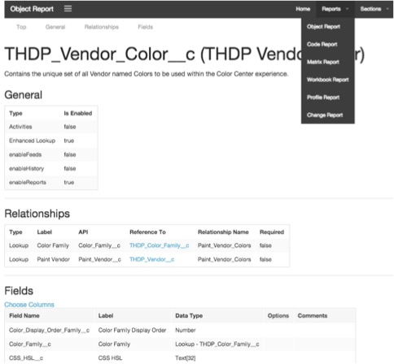
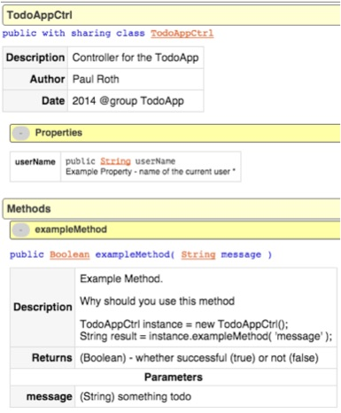
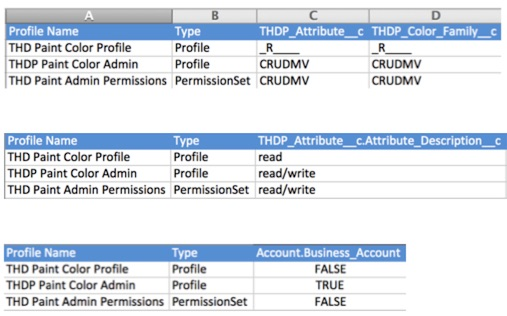
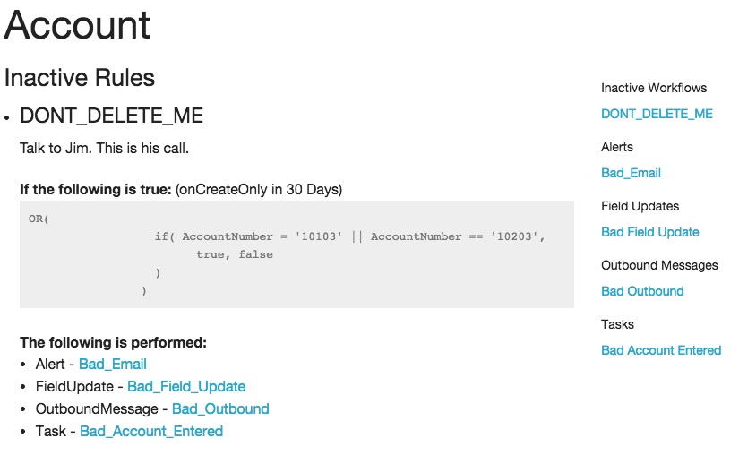
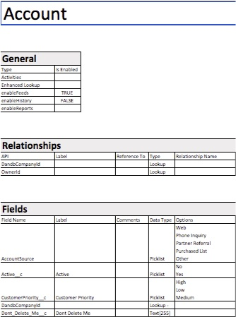
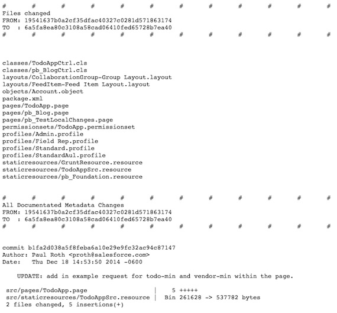

# Automated Documentation

The purpose of setting up automated documentation is to understand and communicate the current state of the org and the work being done.

There are 7 built-in reports available, with an additional 2 reports that can be run separately:

* **Object Report** Lists high level descriptions/information, relationships, fields, field-sets, validation rules and other object specific information.

* **Code Reports** Integrated in ApexDoc documentation

* **Matrix Reports** Spreadsheets demonstrating access across Profile / Permission Sets across a range of information. (CRUDMV/Field/Record Type,Page,Class,Layout,etc.)

* **Workflow Reports** Collection of all workflows linked by their actions (Email, Outbound messages, Field Updates, etc) for easier consumption.

* **Workbook Reports** Object information shown within a spreadsheet for easier massaging / integrating with other systems.

* **Change Report** Collection of changes in Version Control since the last checkin (start of sprint/project) to describe what is needed on the next deploy.

* **Profile Report** Break down of profiles by various information. Similar to the Matrix Reports, but within an HTML page.

Additionally there are also the:
* **Unversioned Changes** - list of changes NOT in version control.
* **Phabricator reports** - available for monitoring automated Code Reviews

##### Please see below for screenshots of each of these reports

	Please note, all objects / classes within the package are included within the reports. To narrow these down to specific projects / sets, simply replace the src/package.xml file with what should be documented.

It is recommended that it is set to always run on a secheduled basis (such as on a Continuous Integration server - such as Jenkins) so it can be integrated with other work (such as after each successful deploy) and accessible to everyone.

While Version Control also is worthwhile in its own right, we also highly recommend it is used in conjunction with the Automated documentation.  This provides better insight into:

* the changes made since the last checkin (beginning of sprint or project, etc)
* monitoring of changes made
* a real-time running tally of items needed for the next deploy.

As these are available through Jenkins, the reports are:

* Available on a Push Button / Scheduled basis
* Flexibility to either document current metadata or only code from version control
* Accessible through a browser without any end-user setup
* Extensible to report on nearly anything available in metadata.

## Report Screenshots

#### Object Report

Lists high level descriptions/information, relationships, fields, field-sets, validation rules and other object specific information.

#### Code Reports

Integrated in ApexDoc documentation

#### Matrix Reports

Spreadsheets demonstrating access across Profile / Permission Sets across a range of information. (CRUDMV/Field/Record Type,Page,Class,Layout,etc.)

#### Workflow Reports

Collection of all workflows linked by their actions (Email, Outbound messages, Field Updates, etc) for easier consumption.

#### Workbook Reports

Object information shown within a spreadsheet for easier massaging / integrating with other systems.

#### Change Report

Collection of changes in Version Control since the last checkin (start of sprint/project) to describe what is needed on the next deploy.

