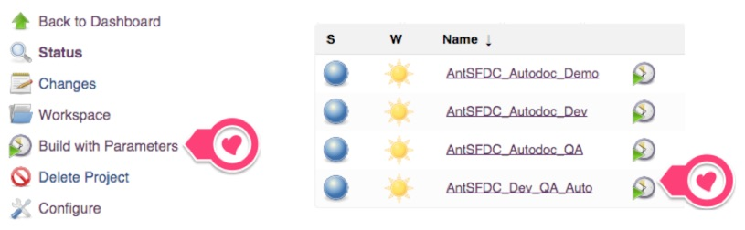

# Automated Documentation

It is recommended that it is set to always run on a secheduled basis (such as on a Continuous Integration server - such as Jenkins) so it can be integrated with other work (such as after each successful deploy) and accessible to everyone.

As these are available through Jenkins, the reports are:

* Available on a Push Button / Scheduled basis
* Flexibility to either document current metadata or only code from version control
* Accessible through a browser without any end-user setup
* Extensible to report on nearly anything available in metadata.

While Version Control also is worthwhile in its own right, we also highly recommend it is used in conjunction with the Automated documentation.  This provides better insight into:

* the changes made since the last checkin (beginning of sprint or project, etc)
* monitoring of changes made
* a real-time running tally of items needed for the next deploy.

** (If you do not want to use Version Control and just want to get setup quickly, see the `README_AutodocSetup_no_VC.pdf` instead)**

** Please note that the monitoring of changes and deployment logs would not be available **

## Setting up as a Git Module

To include the SFDC Ant Project with your code, it is recommended you simply include it as a git module. (Steps below)

This only has to be done once by the TA setting up the project.

Although it takes a slight amount of work, it means that the project supports easier upgrades and everyone on the team has the same version.

Within the terminal:

	git submodule add git@tig2.modelmetricssoftware.com:proth/sfdcantproject.git
	git submodule init
	git submodule update

followed by: 

	git add sfdcantproject
	git commit sfdcantproject
	git push

**The project is now included within your project under the folder 'sfdcantproject'**

## Setting up in Jenkins

### First installation

After a project has the Automated Documentation setup within Jenkins, to setup a new Automated Documentation effort, simply clone the project with some modifications, and you are ready to go.

*This is described below under **Subsequent installations**)*

**(Automated Documentation is already configured within the SalesForce Services Jenkins instance).**

**If running on the SalesForce Services Jenkins instance,** simply clone the 'AntSFDC_Autodoc_Demo' project and continue to **Subsequent installations**

##### Setup Description

Set the Description of the project to include the following:

	
<ul>
	  <li><a href='ws/sfdcantproject/output/index.html'>Automated docs</a> |
		<a href='ws/sfdcantproject/autoDoc.zip/*view*/'>Zip</a></li>
	  <li><a href='ws/sfdcantproject/output/diff/index.html'>
		Unversioned changes</a></li>
	  </ul>
	

	
** Please note, this assumes the sfdcantproject is included as a git module within the project.**

##### Enable 'This build is parameterized'

Define the following parameters, and the defaults to be used when running a new build.

    Type:                String Parameter
	Name:                retrieve.username
	Default Value:       
	Description:         Username for the user to retrieve metadata with.
						 
    Type:                Password Parameter
	Name:                retrieve.password
	Default Value:       
	Description:         Password for the user used to retrieve metadata with.
						 
    Type:                String Parameter
	Name:                retrieve.serverurl
	Default Value:       
	Description:         Full domain of where to retrieve the metadata from. 
						 Ex: login.salesforce.com or test.salesforce.com
						 
    Type:                String Parameter
	Name:                docChanges.lastCommit
	Default Value:       
	Description:         SHA representing the starting point for this release. 
						 (Used in the change report)
						 
    Type:                String Parameter
	Name:                isCI
	Default Value:       true
	Description:         As we are running in Jenkins, 
						 Always say we are running in a Continuous Integrations environment.

##### Define Source Code Management

Enable the project as **Git**
and provide the Repository URL for your project
and the branch (ex: */dev to build the 'dev' branch )

##### Enable 'Recursively update submodules'

This ensures that the sfdcantproject is cloned / updated and in sync with your repo.

##### Enable 'Build Periodically'

Please keep in mind, times are scheduled based on UTC.

To build every morning at 3am EST (10am UTC), you would use:

H H(10) * * *

##### Include the following Build Steps

	Targets:      setup status
				  (note the space)
	Build File:   sfdcantproject/build.xml
	Properties:   run=setup
				  setupOption=1
				  localSrcPath=../src
				  localResourcePath=../resources
				  oldTarget=setup
_				 
				  
	Targets:      resetRefresh              
	Build File:   sfdcantproject/build.xml
	Properties:   
_	
	
	Targets:      docAllAuto
	Build File:   sfdcantproject/build.xml
	Properties:   
	
				  (To build only certain reports, include the property
				  docAll_targets=cleanDocs,matrix,docCode,docObjects,docProfiles,docWorkflows,docWorkbooks,docChanges
				  and remove the desired reports)
_	

	Targets:      docDiffChanges
	Build File:   sfdcantproject/build.xml
	Properties:   

##### You're all set.

You, or anyone in your project can now build the documentation at any time by clicking the green 'build' button. 

You can even send out an email with the underlying URL as a link / button for people to run.

	
   
  

### Subsequent installations

Now you already have a project setup, to start another project (or a different sandbox/prod), simply:

##### Create a new Project

Set the new Item name and clone the existing project.

** Such as 'AntSFDC_Autodoc_Demo' within the SalesForce Services instance **

#### Change the default build paramters

Ensure they are correct with the repo/branch you are using.

##### You're all set.

You, or anyone in your project can now build the documentation at any time by clicking the green 'build' button. 

You can even send out an email with the underlying URL as a link / button for people to run.

