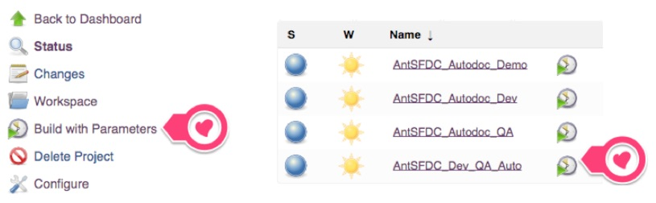
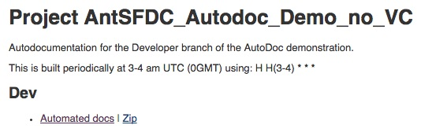

# Automated Documentation without Version Control

It is recommended that it is set to always run on a secheduled basis (such as on a Continuous Integration server - such as Jenkins) so it can be integrated with other work (such as after each successful deploy) and accessible to everyone.

As these are available through Jenkins, the reports are:

* Available on a Push Button / Scheduled basis
* Flexibility to either document current metadata or only code from version control
* Accessible through a browser without any end-user setup
* Extensible to report on nearly anything available in metadata.

While Version Control also is worthwhile in its own right, we also highly recommend it is used in conjunction with the Automated documentation.  This provides better insight into:

* the changes made since the last checkin (beginning of sprint or project, etc)
* monitoring of changes made
* a real-time running tally of items needed for the next deploy.

** If Version Control and change logs/deployment logs are desired, please see the `README_AutodocSetup` guide instead. **

** That functionality is only available if Version Control is used **

## Setting up in Jenkins

### First installation

There is a bit of setup to get the first project setup within Jenkins.

Afterwards, however, the project can simply be cloned with only the build parameters changed.

*This is described below under **Subsequent installations**)*

**If running on the SalesForce Services Jenkins instance,** simply clone the 'AntSFDC_Autodoc_Demo_no_VC' project and continue to **Subsequent installations**

**(Automated Documentation is already configured within the SalesForce Services Jenkins instance).**

##### Setup Description

Set the Description of the project to include the following:

	
<ul>
	  <li><a href='ws/output/index.html'>Automated docs</a>
		<a href='ws/autoDoc.zip/'>Zip</a></li>
	  </ul>
	

##### Enable 'This build is parameterized'

Define the following parameters, and the defaults to be used when running a new build.

    Type:                String Parameter
	Name:                retrieve.username
	Default Value:       
	Description:         Username for the user to retrieve metadata with.
						 
    Type:                Password Parameter
	Name:                retrieve.password
	Default Value:       
	Description:         Password for the user used to retrieve metadata with.
						 
    Type:                String Parameter
	Name:                retrieve.serverurl
	Default Value:       
	Description:         Full domain of where to retrieve the metadata from. 
						 Ex: login.salesforce.com or test.salesforce.com
						 
    Type:                String Parameter
	Name:                docChanges.lastCommit
	Default Value:       
	Description:         SHA representing the starting point for this release. 
						 (Used in the change report)
						 
    Type:                String Parameter
	Name:                isCI
	Default Value:       true
	Description:         As we are running in Jenkins, 
						 Always say we are running in a Continuous Integrations environment.

##### Define Source Code Management

Enable the project as **Git**
and provide the Repository URL for the SFDC Ant Project 
`git@tig2.modelmetricssoftware.com:proth/sfdcantproject.git` 
and the `master` branch

##### Enable 'Recursively update submodules'

This ensures that the sfdcantproject is cloned / updated and in sync with your repo.

##### Enable 'Build Periodically'

Please keep in mind, times are scheduled based on UTC.

To build every morning at 3am EST (10am UTC), you would use:

`H H(10) * * *`

##### Include the following Build Steps

**(The following step sets up the project and provides a list of the current settings to the output)**

	Targets:      setup status
				  (note the space)
	Build File:   sfdcantproject/build.xml
	Properties:   run=setup
				  setupOption=1
				  localSrcPath=force/src
				  localResourcePath=resources
_				 

**(The following creates a package and adds all metadata needed for the reports to run)**

	Targets:      newPackage addDocMetadata
	              (note the space)

(please note, if only certain metadata is needed include the following property:
DocMetadataTypes=CustomObject,Profile,PermissionSet,Layout,Workflow,ApexClass,ApexPage,ApexTrigger
Removing the types of metadata not needed.)

_				 

**(The following retrieves all metadata using the package created above )**

	Targets:      resetRefresh
	              (note the space)
_	

**( The following runs the automated documentatation )**
	
	Targets:      docAllAuto
	Build File:   sfdcantproject/build.xml
	Properties:   
	
				  (To build only certain reports, include the property
				  docAll_targets=cleanDocs,matrix,docCode,docObjects,docProfiles,docWorkflows,docWorkbooks,docChanges
				  and remove the desired reports)

##### You're all set.

You, or anyone in your project can now build the documentation at any time by clicking the green 'build' button. 

You can even send out an email with the underlying URL as a link / button for people to run.

You can then always find the latest version fo the documentation in the 'Automated Docs' link.

Or you can share the automated docs as a zip through the 'Zip' link in the description.

	
   
  

### Subsequent installations

Now you already have a project setup, to start another project (or a different sandbox/prod), simply:

##### Create a new Project

Set the new Item name and clone the existing project.

** Such as 'AntSFDC_Autodoc_Demo_no_VC' within the SalesForce Services instance **

#### Change the default build paramters and save

Ensure they are correct with the repo/branch you are using.

##### You're all set.

You, or anyone in your project can now build the documentation at any time by clicking the green 'build' button. 

You can even send out an email with the underlying URL as a link / button for people to run.

