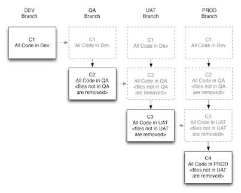
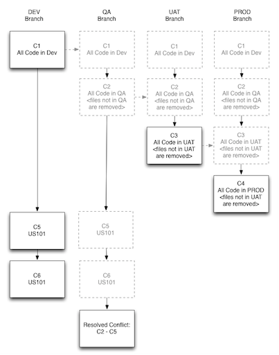

# Overview

The purpose of this project is to provide a streamlined experience to keep SalesForce and version control in synch through the following goals:

* Keep single location of code for SalesForce and Version Control
* Always keep Static Resources up to date and deployed alongside standard depoloyments
* Deploy to SFDC without modifying Version Control and commit when ready.
* Deploy to SFDC in 1/10 the time than eclipse
* Monitor changes in SalesForce against Version Control

# Dependencies

* Apache Ant

(Optional)
* Git (a code repository tool)
* DiffMerge (a code merge tool)

  

## Setting up as a Git Module

To include the SFDC Ant Project with your code, it is recommended you simply include it as a git module. (Steps below)

This only has to be done once by the TA setting up the project.

Although it takes a slight amount of work, it means that the project supports easier upgrades and everyone on the team has the same version.

Within the terminal:

	git submodule add git@bitbucket.org:paulroth3d/sfdcantproject.git
	git submodule init
	git submodule update

followed by: 

	git add sfdcantproject
	git commit sfdcantproject
	git push

**The project is now included within your project under the folder 'sfdcantproject'**

  

# Suggested Project Structure

It is recommended that your git repository includes a your metadata and for uncompressed static resources.

Furthermore, a branch for each salesforce sandbox/org to keep the metadata / resources in synch with each environment.

The metadata folder must contain a `src` folder and is referenced within the project for packaging, deploying and refreshing (among others).

The resources folder is the folder that static resources are automatically expanded and compressed before/after deployments.

(The assumed uncompressed file/folder is configurable, but defaults to the name of the static resource with '_zip' or the extension appended - see below for an example)

Both should be held in the same branch repository to ensure that they remain in sync.  Additional Branches should be made for each sandbox

**(See `AutomatedDocumentation` for additional considerations)**

For example

	MyProjectCheckout/
		force/
			src/
				classes/
					proj1_MyClass.cls
					proj1_AccountCtrl.cls
					proj1_AccountCtrlTest.cls
					
				pages/
					proj1_Account.page
					
				staticresources/
					proj1_foundation.resource
					proj1_icons.resource
					proj1_jquery.resource
					…
		
		resources
			proj1_icons_zip
				img.png
				...
			proj1_foundation_zip/
				…
			proj1_jquery.js
			

Additionally, each environment should be its own separate branch.

The creation of that branch should follow the order of code progression.

# Setup

Each instance of the SFDC Ant Project will need to be initialized for it to run.

However, if this is part of a project, then the setup is easily standardized since the files will always be the same place from one another.

1. Create or locate the 'src' folder to contain the metadata

2. Create or locate the 'resource' folder to contain the extracted static resources. ** Please see Suggested Project Structure **

3. On initial checkout, run the following command 
(this will kick-off the setup process)

**Mac/*Nix**
	
	./setup.sh
	
**Windows**

	setup.bat

When you are done, try running

	ant test

to test your credentials.

## To allow for automatic credentials

If you are following the recommended structure above (having a resources folder next to your salesforce metadata src), you can configure automatic credentials.

** This only needs to be setup once, and will work for all other users **

Run the command:

	ant setupEnvironment
	
followed by

	ant createEnvironmentSettings
	
And put the name of the branch / environment you are currently in.
(There is a bug currently you may have to enter your credentials again)

This creates a file in your resources directory that states the credentials keyname you should be using.

By version controlling that file, and updating it for each environment, simply switching branches will automatically choose the correct credentials.

Try it out

	ant status
	
switch git branch (through tower, or git, etc)

	ant status
	
** This is expanded further in the following section for automated deployments **

## Branching for Automated Deployments

1. Create branch for **DEVELOPMENT**.
2. Ensure the src/package.xml is correct and up to date.
3. Run `ant setupEnvironment` to name the environment and specify the credentials.
4. Run `ant createEnvironmentSettings` and set the branch to the name of the environment.
5. Run `ant refresh` to ensure all code for **DEVELOPMENT** is in version control and commit.
6. Make a tag of the **DEVELOPMENT** branch.

#### Then for each following environments
1. Make a branch off the commit from previous step for **QA**
2. Ensure the src/package.xml is correct and up to date.
3. Run `ant setupEnvironment` to name the environment and specify the credentials.
4. Run `ant createEnvironmentSettings` to allow automatic credential selection and commit.
5. Run `ant refresh` to ensure all code for **QA** is in version control and commit.
6. Make a tag of the **QA** branch.

... Repeat for any additional branches up the chain (including production).

#### Seen a different way

Each branch represents an indidivual org/sandbox. People can (and should) make changes to metadata through point and click means.  These changes also should be captured and migrated just the same as any developer oriented changes.

Having each branch specifically represent an individual org/sandbox allows tracking those changes very simply, and provides additional means of tracking and monitoring what changes have been complete, when and raise it as a discussion of whether it should be committed / migrated or not.

#### Merges

As changes are then completed, such as US105 and US106, these changes can be tested and deployed out to DEV.

	(such as by adding to a package list and deploying the package list)
	or simply by using a third party tool and using `ant refresh` to pull the latest from 	the org.

When the changes are confirmed and ready for promotion, they are committed - and therefore scheduled for deployment.

This means that the files being deployed to QA are essentially the latest from QA + the merged changes, and only the files that were changed.

This provides a number of features:

* Only the change is migrated - the rest of the file stays the same.
* There is no more guessing about whether US106 has been deployed
* Conflicts would be known and can be handled prior to deployment

Furthermore, it opens the gates for Automated Deployment - such as simple deployments only by performing a git merge.

To initiate the deployment, simply merge DEV with QA and push the change.

This would allow the autodeploy to discover a commit as ready for deploy.  (Which would then find all commits performed since last autodeploy, package and deploy only those files.)
